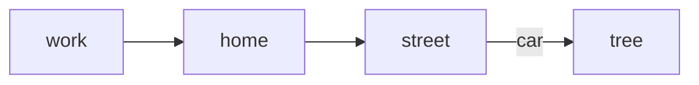
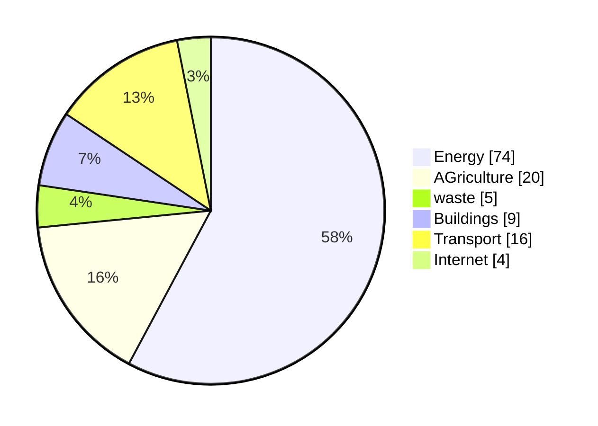
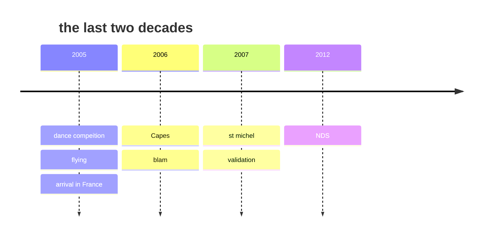

# Here is the headign of this post

This post is bascially a bunch of markdown syntax tests.

<!--more-->

| Column 1 | Column 2 | Column 3                                                                   |
| -------- | -------- | -------------------------------------------------------------------------- |
| Text     | Text     | Text  balh blah blhab ablhalshblhasldkfjlaljfdkfjsl <br> another blah blah |
| text 2   | blah     | huh???                                                                     |
| bamm     | boom     | biim                                                                       |

- [ ] do this
- [ ] do that
- [x] do teh toher hting?

> and hten he said, wtf dude?

Let's do some python [^1]

[^1]: Python is a programming language that is so cool.

```python
print("hello world")
def vitesse(x,v):
    ax + bx^2
    return vitesse
```

### small headign
This is goign to be **quite** interesting *no?*

>Do this but dont that
{: .prompt-tip }

>Do NOT do that.
{: .prompt-warning }

>You did that!!!
{: .prompt-danger }

>yay!
{: .prompt-info }




## here is 4 things 

a bit of math now?
$$ y = x + \frac{d^2x}{dt^2} = \frac{\partial^2 y}{\partial x}$$

```abc
ABabcCcC | Ddef^f_A | C[ce^gC]
```





```mermaid
journey
    title me study housework
    but again not
```


Let's do a foonote. I wanna put it here. [^2]

[^2]: This is where the first footnote goes. i wonder if it's any good.

2 <sup>55-33</sup>


>[!Important]
>Here is somethign importnat to remember

>[!Tip]
> Here is somethign about color
`#ffffff`
`#687111`

>[!Warning]

>[!Caution]


[Back to top](#top)
[:arrow_up:](#top)
